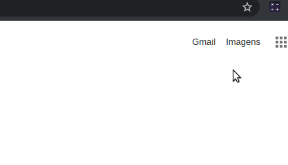

# :tada: Quick Calculator :tada:

Google Chrome browser extension that performs mathematical calculations of basic operations.

## Screenshot :camera:

## License :memo:

This project is licensed under the MIT License - see the [LICENSE](LICENSE) file for details.